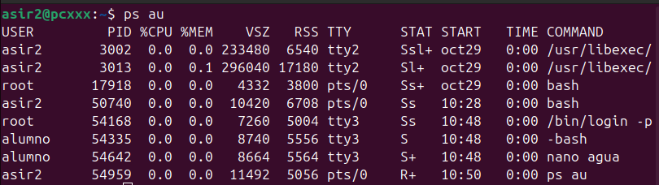
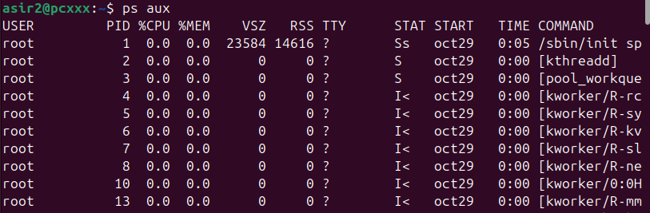
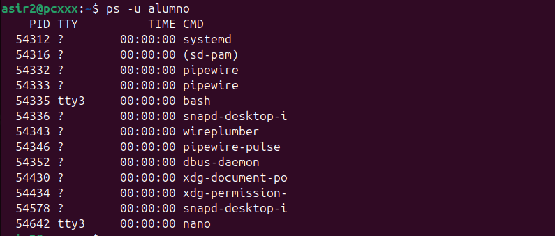
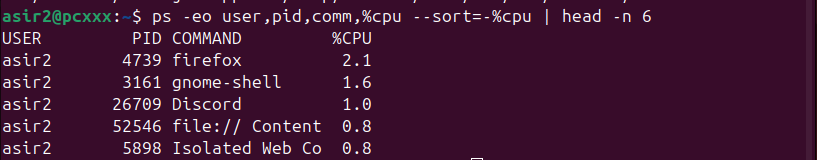
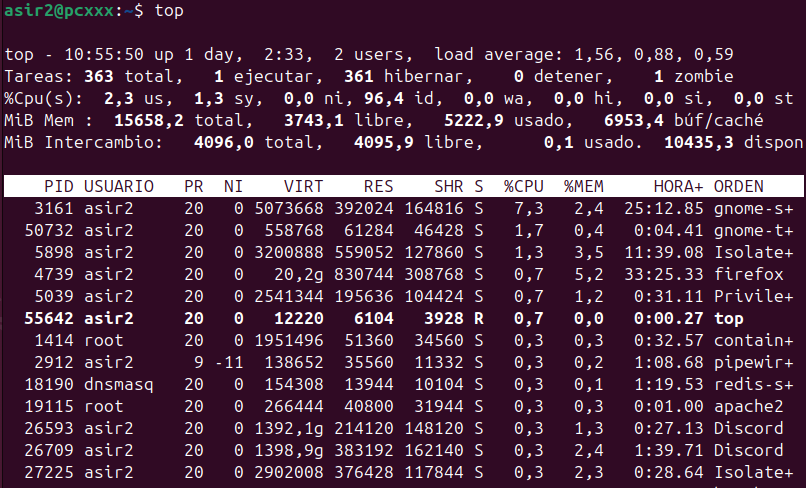
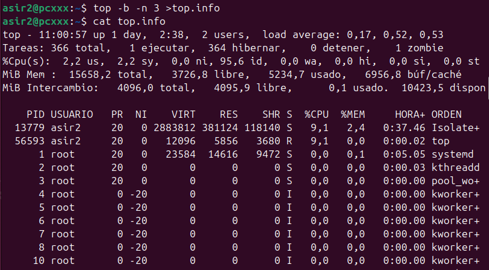
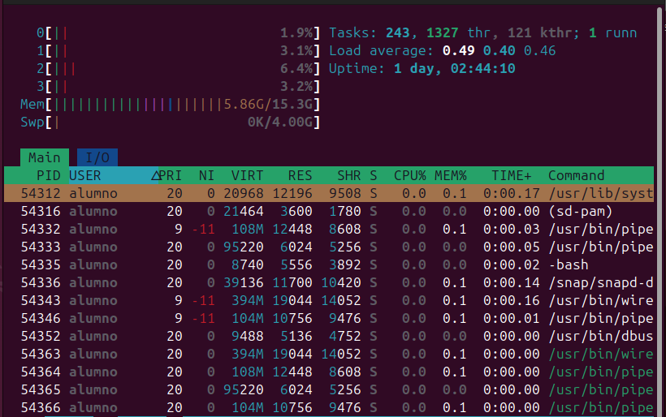

#### [Volver al inicio](../README.md)

# 🖥️ Análisis de Comandos de Procesos en Linux

Este documento explica varios comandos utilizados para monitorear procesos en un sistema Linux. 

---

## 📜 Comandos `ps` (Process Status)

El comando `ps` (Process Status) se usa para tomar una "foto" o instantánea de los procesos en ejecución en un momento dado. Tiene muchas opciones para filtrar y formatear la salida.

### `ps au`

> `ps au`

Este comando muestra los procesos de **todos los usuarios** (`a`) en un formato **orientado al usuario** (`u`). Este formato es muy útil ya que incluye columnas como `USER`, `PID`, `%CPU`, `%MEM`, `TTY` (la terminal asociada) y el `COMMAND` completo.

### `ps aux`

> `ps aux`

Es muy similar a `ps au`, pero añade la opción `x` (estilo BSD). Esta opción es crucial ya que incluye también los procesos que **no están asociados a ninguna terminal** (como los demonios o servicios del sistema). Es una de las formas más comunes de ver *todo* lo que se está ejecutando.

### `ps -u [usuario]`

> `ps -u alumno`

Esta es una forma sencilla de filtrar la lista de procesos para ver únicamente aquellos que pertenecen a un usuario específico, en este caso, "alumno".

### `ps` con formato y orden personalizado

> `ps -eo user,pid,comm,%cpu --sort=-%cpu | head -n 6`

Este es un uso avanzado y muy potente de `ps`:
* `ps -eo ...`: Muestra todos los procesos (`e`) con un **formato de salida personalizado** (`-o`). Aquí pedimos `user`, `pid`, `comm` (nombre del comando) y `%cpu`.
* `--sort=-%cpu`: **Ordena** la salida por la columna %CPU en orden descendente (el `-` indica de mayor a menor).
* `| head -n 6`: Envía el resultado al comando `head`, que **filtra** y muestra solo las primeras 6 líneas (la cabecera y los 5 procesos que más CPU consumen).

---

## 📊 Comando `top` (Table of Processes)

A diferencia de `ps`, `top` es una herramienta que proporciona una **vista dinámica y en tiempo real** del estado del sistema y los procesos. Se actualiza automáticamente.

### `top` (Modo Interactivo)

> `top`

Esta es la vista estándar de `top`. Muestra un resumen del sistema (carga, tareas, memoria) y, debajo, una lista de los procesos que más recursos consumen (por defecto, CPU).

### `top` (Modo Batch)

> `top -b -n 3 > top.info`
> `cat top.info`

`top` también se puede ejecutar en **"modo batch"** (`-b`), que es no-interactivo y permite redirigir su salida a un archivo.
* `-n 3`: Indica que tome 3 "fotos" o iteraciones y luego termine.
* `> top.info`: Guarda esa salida en el archivo `top.info`.
* `cat top.info`: (El segundo comando en la imagen) Simplemente muestra el contenido del archivo que se acaba de crear.

---

## ✨ Comando `htop` (Visor Interactivo)

> `htop`

`htop` es una alternativa moderna y muy popular a `top`. Ofrece una experiencia mucho más visual e interactiva:
* Muestra gráficos de uso de **CPU por núcleo**, Memoria y Swap.
* Permite desplazarse vertical y horizontalmente por la lista de procesos.
* Facilita la gestión de procesos (como matar o cambiar la prioridad) usando teclas de función.

