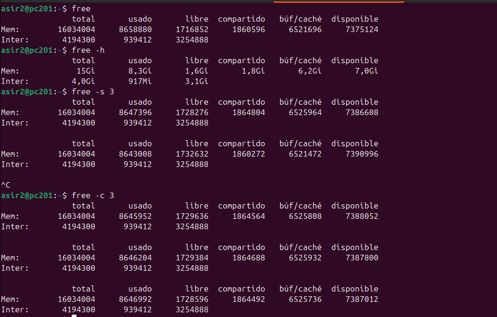
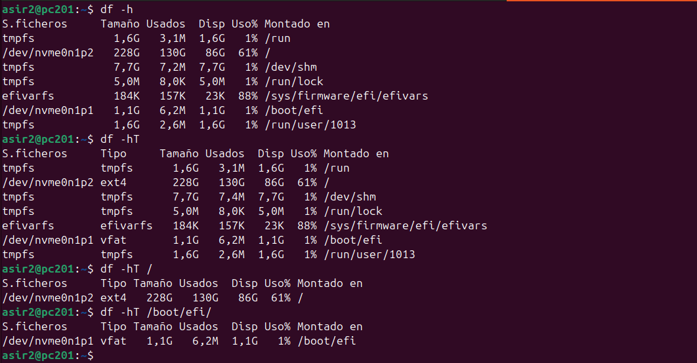
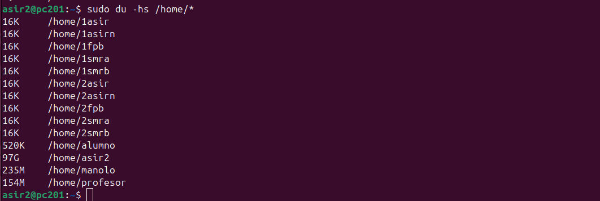

# 💾 Análisis de Comandos de Sistema y Disco en Linux

Este documento explica varios comandos utilizados para monitorear el estado del sistema, la memoria y el uso del disco en un sistema Linux.

---

## 🧠 Comando `free` (Memoria)

El comando `free` muestra la cantidad total de memoria física (RAM) y de intercambio (swap) libre y utilizada en el sistema, así como los búferes y la caché utilizados por el kernel.

### `free`

> `free` (a menudo usado con `-m` para megabytes o `-h` para formato legible)

Este comando es fundamental para diagnosticar problemas de rendimiento relacionados con la memoria.
* **total**: Memoria total disponible.
* **used**: Memoria en uso.
* **free**: Memoria libre (sin usar).
* **buff/cache**: Memoria usada por los búferes del kernel y la caché de página.
* **available**: Una estimación de cuánta memoria está disponible para iniciar nuevas aplicaciones sin necesidad de swap.

---

## 💽 Comando `df` (Disk Free)

El comando `df` (Disk Free) informa sobre el **espacio de disco utilizado y disponible en los sistemas de archivos** (particiones montadas).

### `df -h`

> `df -h`

Es la forma más común de usarlo.
* `df`: Muestra el uso del disco.
* `-h`: (Human-readable) Muestra los tamaños en un formato legible (por ejemplo, `10G` en lugar de `10485760`).

Es útil para ver rápidamente si un disco o partición (como `/`, `/home`, o `/boot`) se está quedando sin espacio.

---

## 📁 Comando `du` (Disk Usage)

A diferencia de `df` que mira las particiones, `du` (Disk Usage) se usa para **estimar el espacio utilizado por archivos y directorios** específicos.

### `du -hs [ruta]`

> `du -hs /ruta/a/carpeta`

Este es un uso muy común para encontrar qué carpetas ocupan más espacio.
* `-h`: (Human-readable) Muestra los tamaños en formato legible.
* `-s`: (Summarize) Muestra solo un total para cada argumento (es decir, el tamaño total de la carpeta) en lugar de listar cada subcarpeta.

---

## ⏱️ Comando `iostat` (Input/Output Statistics)

`iostat` es una herramienta potente para monitorear el rendimiento de los dispositivos de entrada/salida (I/O) del sistema, principalmente los discos.

### `iostat -x`

> `iostat -x`

La opción `-x` proporciona estadísticas extendidas, que son mucho más útiles para el diagnóstico.
* `r/s` y `w/s`: Lecturas (reads) y escrituras (writes) por segundo.
* `await`: El tiempo promedio (en milisegundos) que las solicitudes de I/O esperan.
* `%util`: Porcentaje de tiempo que el dispositivo estuvo ocupado. Un valor cercano al 100% indica un cuello de botella en el disco.

# [Volver al inicio](../README.md)
