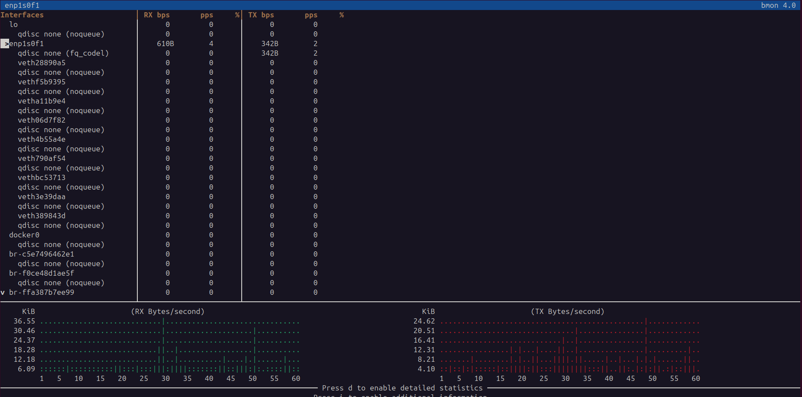
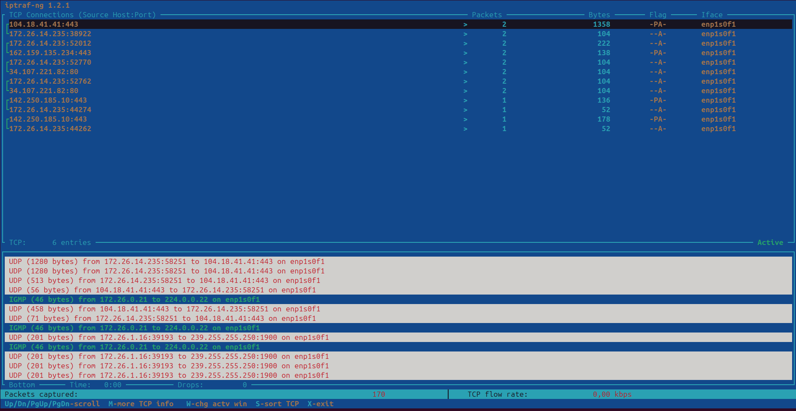
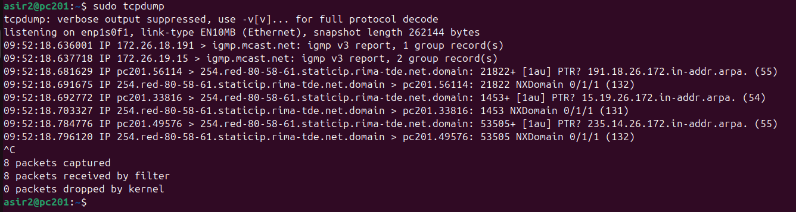
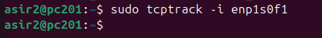
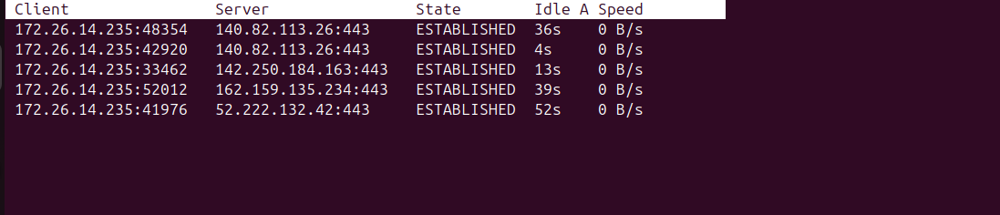

# 🌐 Tráfico de la red

Este documento explora herramientas de línea de comandos para monitorear el tráfico y el ancho de banda de la red en tiempo real.

---

## 📊 Comando `bmon` (Bandwidth Monitor)

`bmon` es una herramienta de monitoreo y depuración de red que captura estadísticas de red y las presenta visualmente en una interfaz de texto (TUI).

### `bmon` (Modo Interactivo)

> `bmon`

Al ejecutarlo, `bmon` presenta una lista de las interfaces de red del sistema. Se puede seleccionar una para ver gráficos detallados en tiempo real del tráfico de **Recepción (Rx)** y **Transmisión (Tx)**.

---

## 🚦 Comando `iptraf` (IP Traffic Monitor)

`iptraf` (o su versión más nueva `iptraf-ng`) es una utilidad de estadísticas de red basada en ncurses. Proporciona un monitor de tráfico IP, estadísticas de interfaz y desgloses detallados del tráfico por protocolo o puerto.

### `iptraf` (Modo Interactivo)

> `iptraf-ng`

`iptraf` es una herramienta de menú. Permite iniciar diferentes tipos de monitores, como un rastreador de tráfico general, estadísticas por tamaño de paquete, o tráfico por puerto TCP/UDP. Es excelente para obtener una visión general de *qué* tipo de tráfico está fluyendo.

---

## 🕵️‍♂️ Comando `tcpdump` (Packet Analyzer)

`tcpdump` es la herramienta de análisis de paquetes (sniffer) de línea de comandos por excelencia. Permite capturar y mostrar el tráfico de red que pasa por una interfaz.

### `tcpdump`

> `tcpdump -i [interfaz]` (ej. `tcpdump -i eth0`)

Imprime en la terminal una descripción de los paquetes que se están capturando. Es increíblemente potente y se puede filtrar para mostrar solo tráfico de un host, puerto o protocolo específico (ej. `tcpdump -i eth0 port 80`).

---

## 🚚 Comando `tcptrack` (TCP Connection Tracker)

`tcptrack` es una herramienta que muestra el estado de las conexiones TCP en una interfaz de red, de una manera similar a como `top` muestra los procesos.

### `tcptrack -i [interfaz]`

> `tcptrack -i eth0`

Muestra una lista en tiempo real de todas las conexiones TCP activas, incluyendo la IP de origen, la IP de destino, los puertos y la velocidad de transferencia de datos actual. Es muy útil para ver quién está conectado a tu máquina y cuánto ancho de banda está usando.

# [Volver al inicio](../README.md)
