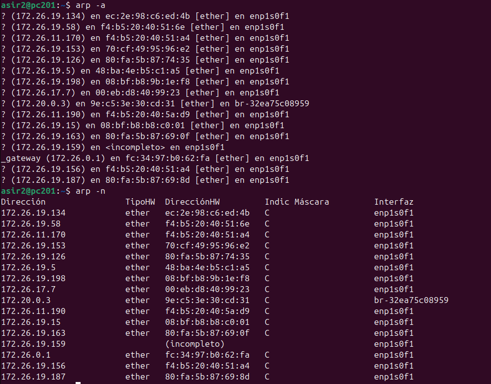
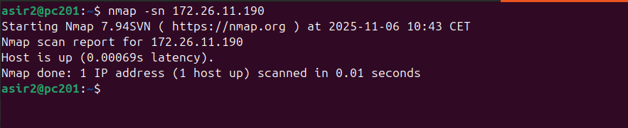
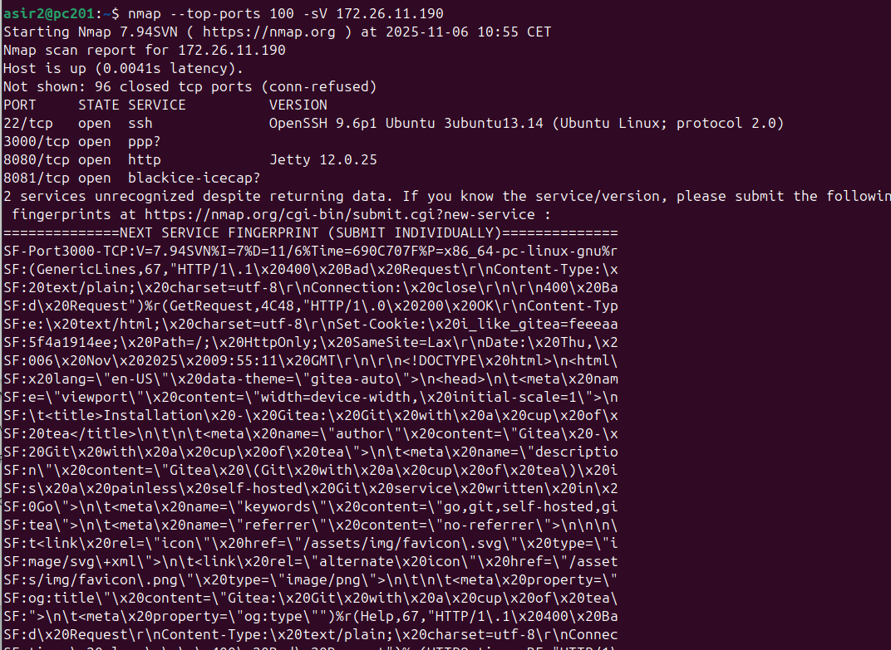
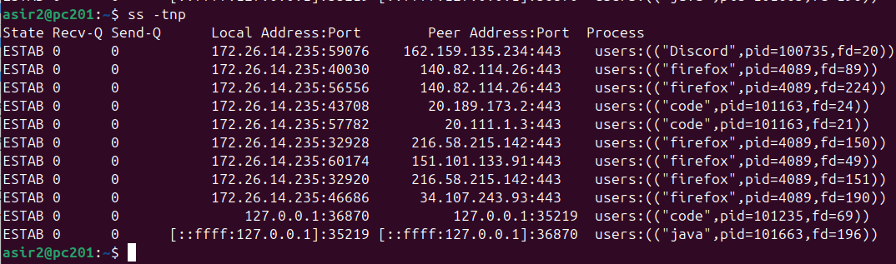
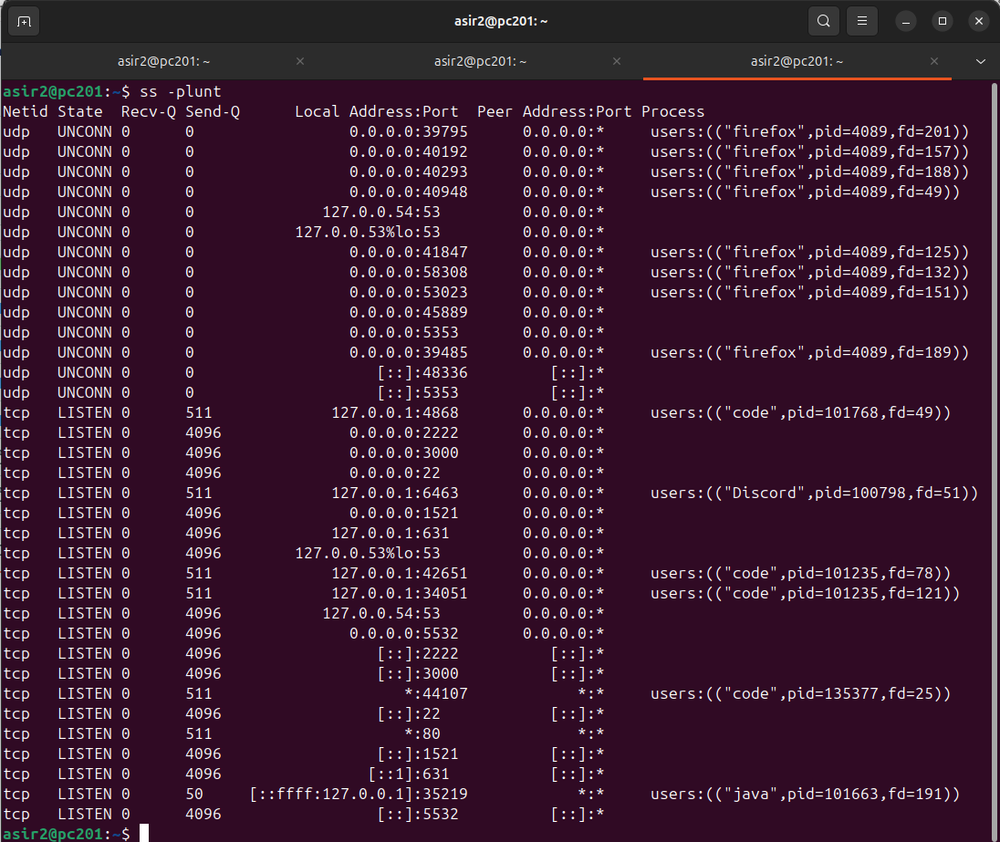
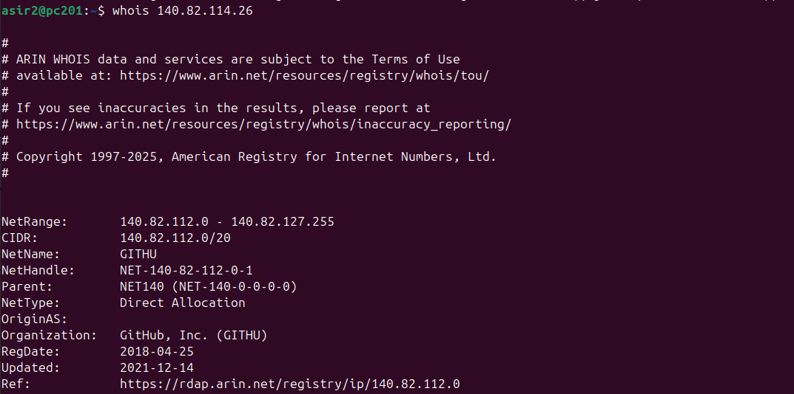

# 📡 Puertos

Este documento detalla comandos esenciales para descubrir dispositivos en la red, escanear puertos e inspeccionar las conexiones de red (sockets).

---

## 🗺️ Comando `arp` (Address Resolution Protocol)

El comando `arp` se usa para ver y manipular la caché ARP del sistema. Esta caché almacena la correspondencia entre direcciones IP (Capa 3) y direcciones MAC (Capa 2) en la red local.

### `arp -an`

> `arp -an`

Este comando muestra el contenido de la caché ARP.
* `-a`: Muestra todas las entradas actuales.
* `-n`: (Numeric) Evita que `arp` intente resolver las direcciones IP a nombres de host (DNS), lo que hace que la salida sea más rápida y limpia.

---

## 🚪 Comando `nmap` (Network Mapper)

`nmap` es una herramienta extremadamente potente y versátil para el descubrimiento de redes y la auditoría de seguridad.

### `nmap -sn [red]` (Ping Scan)

> `nmap -sn 192.168.1.0/24`

Este es un "Ping Scan". Es una forma rápida de descubrir qué hosts están "vivos" o activos en una red.
* `-sN`: (Scan No-port) Le dice a `nmap` que solo descubra los hosts, sin realizar un escaneo de puertos.

### `nmap --top-ports [N] [host]`

> `nmap --top-ports 20 192.168.1.1`

En lugar de escanear los 65,535 puertos posibles, este comando escanea solo los `N` puertos más comunes. Es una forma mucho más rápida de obtener una visión general de los servicios principales que ejecuta un host.

---

## 🔌 Comando `ss` (Socket Statistics)

`ss` es la herramienta moderna para reemplazar a `netstat`. Se utiliza para investigar sockets (conexiones de red TCP, UDP, etc.) en el sistema.

### `ss -tnp`

> `ss -tnp`

Esta combinación es útil para ver las conexiones TCP activas.
* `-t`: Muestra solo sockets **TCP**.
* `-n`: (Numeric) Muestra números de puerto (ej. `80`) en lugar de nombres de servicio (ej. `http`).
* `-p`: Muestra el **proceso** (programa) que está utilizando el socket.

### `ss -plunt`

> `ss -plunt`

Esta es una combinación muy común para ver *todos* los sockets que están "a la escucha" (servicios esperando conexiones).
* `-p`: Muestra el **proceso**.
* `-l`: Muestra solo sockets en estado **LISTEN** (escuchando).
* `-u`: Incluye sockets **UDP**.
* `-n`: (Numeric) Muestra números de puerto.
* `-t`: Incluye sockets **TCP**.

---

## 👤 Comando `whois` (Domain/IP Lookup)

`whois` es una utilidad que consulta bases de datos públicas para obtener información de registro sobre un nombre de dominio o una dirección IP.

### `whois [IP/dominio]`

> `whois 8.8.8.8`

Al consultar una dirección IP, `whois` generalmente te devuelve la organización propietaria de ese bloque de IP (por ejemplo, el ISP o la empresa, como Google en el caso de `8.8.8.8`), junto con información de contacto y la ubicación geográfica del registro.

# [Volver al inicio](../README.md)
